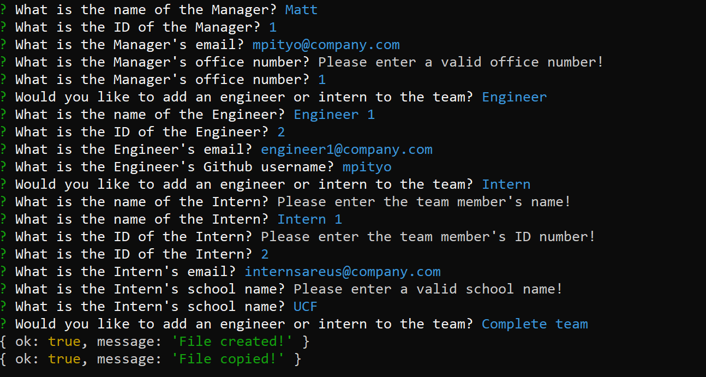
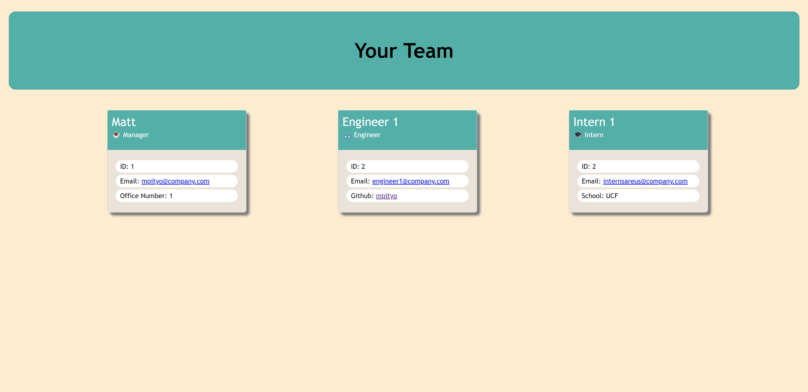

# Team Profile Generator
Get a graphical look at your team with this easy to use command line application. Will display your team on a graphical HTML file without you ever having to touch a line of code (or CSS!)
<br>

## 🚚 Getting it up and running
1. Clone the codebase from the [repo](https://github.com/mpityo/team-profile-generator).
2. Query to the root file directory in any command prompt
3. Run the following command to install required packages:
```
npm install
```
4. Run app through node and fill out required sections:
```
node index.js
```
HTML and CSS files will be created in the <heavy>./dist/</heavy> directory

Walkthrough of application can be viewed [here](https://drive.google.com/file/d/1blh780ilpqNmn3AtasbPIujox0qwQhT2/view?usp=sharing)


## :memo: Features
 - Lightweight: no added CSS or graphical HTML libraries
 - Responsive: no matter the screen size your information will always be front and center
 - User friendly inquirer: Usage of the inquirer dependency leads to an easy and fast user data entry experience
 - Able to run on any command prompt and any system
 - CSS is easily modifiable before or after HTML file is created
 
## :trophy: Credit
Project idea and graphical inspiration taken by @UCFBootCamp
<br>
Full JS, HTML and CSS functionality by yours truly, @mpityo
<br>
<br>
Project is fully open source: explore the code and upgrade away!
<br>
<br>


<br>

